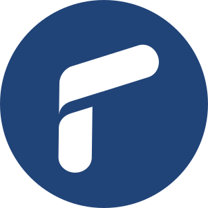

<div align="center" id="top"> 
  

  &#xa0;

  <!-- <a href="https://testretake.netlify.app">Demo</a> -->
</div>

<h1 align="center">Test Retake Brasil</h1>

<p align="center">
  

  

  

  

  <!--  -->

  <!--  -->

  <!--  -->
</p>

 <!-- Status  -->

<!-- <h4 align="center"> 
	🚧  Test Retake 🚀 Under construction...  🚧
</h4>  -->

<hr>

<p align="center">
  <a href="#dart-about">About</a> &#xa0; | &#xa0; 
  <a href="#sparkles-features">Features</a> &#xa0; | &#xa0;
  <a href="#rocket-technologies">Technologies</a> &#xa0; | &#xa0;
  <a href="#white_check_mark-requirements">Requirements</a> &#xa0; | &#xa0;
  <a href="#checkered_flag-starting">Starting</a> &#xa0; | &#xa0;
  <a href="#memo-license">License</a> &#xa0; | &#xa0;
  <a href="https://github.com/ailsonazevedo" target="_blank">Author</a>
</p>

<br>

## :dart: About ##

Este projeto tem como objetivo de cadastrar, editar e remover Processos Judiciais. Conta também com um\
scraping, onde são cadastrados no banco as informações recebidas.

Tela de Login admin:\


Tela do ambiente admin:\


Tela Inicial:\


Tela de Processos:\


## :sparkles: Features ##

:heavy_check_mark: Cadastrar Processos\
:heavy_check_mark: Editar Processos\
:heavy_check_mark: Remover Processos\
:heavy_check_mark: Cadastrar Partes\
:heavy_check_mark: Remover Partes\
:heavy_check_mark: Scraping de Processos

## :rocket: Technologies ##

Tecnologias e libs usadas no projeto:

- [Django](https://www.djangoproject.com/)
- [Bootstrap](https://getbootstrap.com/)
- [django-bootstrap5](https://django-bootstrap-v5.readthedocs.io/en/latest/#)
- [django-jazzmin](https://django-jazzmin.readthedocs.io/)
- [Docker](https://www.docker.com/)
- [pipenv](https://pipenv.pypa.io/en/latest/)

## :white_check_mark: Requirements ##

Before starting :checkered_flag:, Para rodar o projeto você vai precisar do [Git](https://git-scm.com), [Docker](https://www.docker.com/) 
e [Python 3.10](https://www.python.org/) instalados.

## :checkered_flag: Starting ##

```bash
# Clone do projeto
$ git clone https://github.com/ailsonazevedo/test-retake

# entrar na pasta raiz do projeto
$ cd test-retake
```
Para baixar a imagem do docker:
```bash
$ docker run ailsonazevedo1/test-retake
```
Digite o seguinte comando para iniciar o container
```bash
$ docker-compose up
```
Se desejar fazer o build de uma nova imagem, digite o seguinte comando no seu terminal:
```bash
$ docker-compose up --build
```
Pronto, após iniciar o container o projeto estará disponível na seguinte url:
```bash
$ http://127.0.0.1:8000/
```
Criando um usuário no django pelo container
```bash
$ docker ps
```
Copie o id do seu container, aqui o meu id é este marcado em vermelho:\


Em seguida rode o segundo comando para entrar no modo interativo:
```bash
$ docker exec -it "containerid" sh
```


Após entrar no modo interativo basta criar o super usuário
```bash
$ python manage.py createsuperuser
```


Para sair do modo interativo basta digitar:
```bash
$ exit
```


<h2>Rodando Localmente:</h2>

Caso deseje rodar o projeto em uma Máquina Virtual local, siga os seguintes passos:\
1 - Crie uma Máquina Virtual
```
$ python -m venv nomedamaquina
```
2 - Ative a Máquina Virtual
```bash
# Se você usa Windows
$ nomedamaquina/Scripts/active

# Se você usa Linux
$ source nomedamaquina/bin/activate
```
3 - Instalar as Dependências
```bash
# Ele irá instalar todas as dependências encontradas no Pipfile
$ pipenv install
```
4 - Crie as Migrações
```bash
$ python manage.py migrate
```
5 - Crie um Usuário Admin
```bash
$ python manage.py createsuperuser
```
6 - Agora é só iniciar o servidor
```bash
$ python manage.py runserver
```
Url para acessar:
```bash
$ http://127.0.0.1:8000/
```
## :memo: License ##

This project is under license from MIT. For more details, see the [LICENSE](LICENSE.md) file.


Made with :heart: by <a href="https://github.com/ailsonazevedo" target="_blank">Ailson Azevedo</a>

&#xa0;

<a href="#top">Back to top</a>
